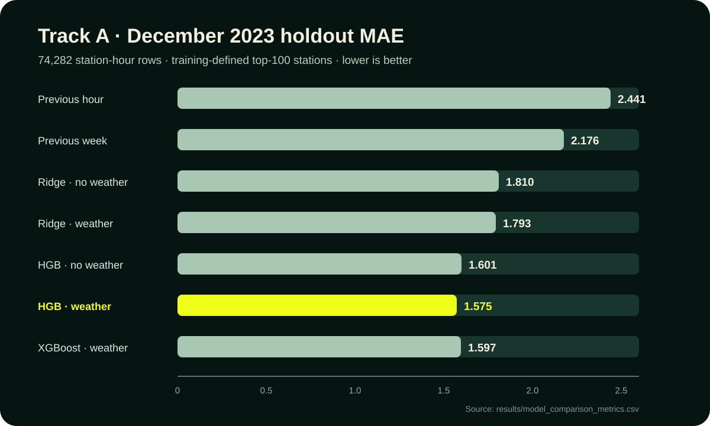
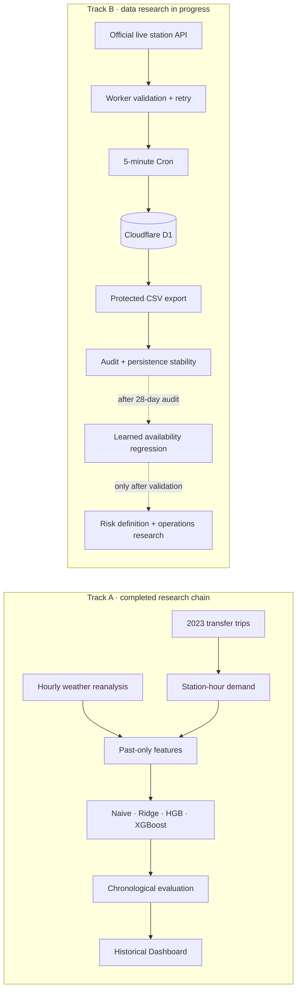

# YouBike Demand Prediction

> Historical transfer-demand forecasting and ongoing station-availability research

**Independent Time-Series Research Project · In Progress**

This repository contains two separate time-series studies built around Taipei YouBike data. Track A forecasts historical hourly transfer-related borrowing demand and has completed its main evaluation and dashboard. Track B collects live station inventory in the cloud and has completed a fixed fourteen-day data audit and persistence-stability analysis; its first learned availability model has not started.

本專案包含兩條不可混用目標的研究線：Track A 已完成歷史轉乘需求預測的主要研究與回測展示；Track B 正在累積即時站點庫存資料，已完成固定十四天稽核，但尚未建立正式 learned model。缺車／滿站風險與調度最佳化仍是後續研究。

## Quick links

| Entry | What it contains |
|---|---|
| [Historical Dashboard / 歷史回測展示](dashboard/README.md) | Local launch instructions and the scope of the 10-timepoint historical holdout demo |
| [中文總覽](docs/PROJECT_OVERVIEW_STATUS_AND_TECHNOLOGY.md) | Complete Traditional Chinese project overview, architecture, evidence, and current status |
| [Track A research summary](docs/STAGE_13_TRACK_A_RESEARCH_SUMMARY.md) | Experiment design, model comparison, rolling-origin validation, ablation, and error analysis |
| [Reproducibility guide](docs/REPRODUCIBILITY.md) | Data, training, inference, dashboard, Track B export, and verification commands |
| [Track B fourteen-day analysis](docs/STAGE_16_TRACK_B_14_DAY_STABILITY.md) | Fixed-window audit, weekday/weekend description, and persistence stability |

The existing hosted dashboard deployment was verified on 2026-09-09 but remains owner-restricted. No inaccessible URL is presented here as a public demo; the repository provides its source, static bundle, share artwork, and local entry point.

## Current status

| Workstream | Status | Evidence-backed scope |
|---|---|---|
| **Track A — historical transfer demand** | Main research and evaluation complete; maintenance | 2023 transfer-related trips, training-defined top-100 stations, chronological holdout, historical dashboard |
| **Track B — station availability** | Data research in progress | Cloud collection active; fixed 14-day audit and persistence stability complete; learned model not started |
| **Shortage/full risk and redistribution** | Not implemented | Requires a validated availability forecast, explicit risk costs, and operational constraints |

The repository as a whole is not marked completed, frozen, or production-ready.

## Results at a glance

### Track A — historical hourly transfer-demand forecasting

- **7,388,479** official 2023 transfer-related trips.
- **100** high-demand stations selected using the training period only.
- Chronological split: January–September training, October–November validation, December holdout.
- Holdout scope: **74,282 station-hour rows**.
- Primary model: HGB with weather — **MAE 1.575, RMSE 2.549, R² 0.794**.
- Rolling-origin HGB MAE: **1.636, 1.592, 1.606**.
- XGBoost was evaluated on the same scope and did not outperform HGB.

繁中摘要：Track A 以 74,282 筆十二月 holdout station-hour rows 評估，HGB with weather 為目前主模型；這些數值只代表定義內的歷史轉乘相關借車需求。

| Model | Holdout MAE | RMSE | R² |
|---|---:|---:|---:|
| Previous hour | 2.441 | 4.129 | 0.460 |
| Previous week, same hour | 2.176 | 3.701 | 0.566 |
| Ridge without weather | 1.810 | 2.911 | 0.731 |
| Ridge with weather | 1.793 | 2.889 | 0.736 |
| HGB without weather | 1.601 | 2.567 | 0.791 |
| **HGB with weather** | **1.575** | **2.549** | **0.794** |
| XGBoost with weather | 1.597 | 2.580 | 0.789 |



*December 2023 holdout, 74,282 rows, training-defined top-100 stations. Lower MAE is better. Source: [`results/model_comparison_metrics.csv`](results/model_comparison_metrics.csv). R² is not an accuracy percentage.*

### Track B — fixed fourteen-day station-availability analysis

Completed analysis window:

```text
[2026-08-21 09:45:02 UTC, 2026-09-04 09:45:02 UTC)
```

| Data-quality measure | Result |
|---|---:|
| Station rows | 7,240,919 |
| Snapshots | 4,031 |
| Distinct stations | 1,800 |
| Duplicate station-time keys | 0 |
| Estimated missing five-minute slots | 1 |

The unchanged persistence rule is `prediction(t + horizon) = available_bikes(t)`. It is a non-learned reference baseline.

| Horizon | Week 1 MAE | Week 2 MAE |
|---|---:|---:|
| 30 minutes | 1.704 | 1.030 |
| 60 minutes | 2.544 | 1.564 |

The two weeks differ materially. Because persistence does not train or update, the lower Week 2 errors describe a different data context—not continuous model learning or improvement. Track B results use a different target, unit, and evaluation scope from Track A and do not belong in the Track A model ranking.

繁中摘要：固定十四天資料有 0 筆重複鍵、估計缺一個五分鐘時槽；兩週 MAE 差異是情境變動，不是模型持續學習，正式 learned model 尚未開始。

## Research tracks

### Track A: problem, data, method, and findings

**Question.** Can station identity, calendar patterns, past demand, and weather predict a station's transfer-related borrowing count for a specified hour?

**Data.** The study uses the official twelve-month 2023 transfer-related YouBike trip dataset and 8,760 hourly Open-Meteo reanalysis observations from one Taipei reference point. It does not cover all YouBike trips.

**Method.** Station selection is training-only. Lag and rolling features look backward. Model choices use validation data, while December remains the final holdout. Compared methods include previous-hour and previous-week baselines, Ridge, Histogram Gradient Boosting, and XGBoost, followed by rolling-origin validation, permutation importance, feature-group ablation, and contextual error analysis.

**Findings.** HGB with weather is the strongest evaluated Track A model. Calendar, recent history, station identity, and daily history carry the most useful signal; weather adds a smaller incremental gain. Errors remain larger during commuting peaks, at high-demand stations, and for high-demand hours. Full evidence is in the [Track A research summary](docs/STAGE_13_TRACK_A_RESEARCH_SUMMARY.md).

### Track B: problem, data infrastructure, and current evidence

**Question.** After enough continuous observations are available, can station inventory be forecast 30 or 60 minutes ahead?

**Data infrastructure.** A Cloudflare Worker validates the official live schema, retries bounded API failures, and writes five-minute station snapshots to D1. A database primary key prevents duplicate station-time rows; structured run logs and a protected, paginated CSV export support audit and Python analysis. Local collectors remain testing and fallback tools, not the formal long-running solution.

**Current evidence.** The fixed fourteen-day window has passed duplicate, coverage, station-change, timestamp, and future-target checks, with one estimated missing slot. The persistence comparison shows that baseline difficulty changes across weeks. This is sufficient for a data-readiness checkpoint, not for a learned availability or shortage-risk claim.

### Conditional future research

1. Accumulate a fixed 28-day dataset and pass coverage, missingness, duplicate, and station-change audits.
2. Freeze a chronological split and compare learned 30/60-minute regression with persistence on the same test scope.
3. Only after a useful forecast exists, define shortage/full-station labels and the costs of false alarms and missed events.
4. Evaluate redistribution methods only after operational constraints and decision objectives are explicit.

The planned 28-day check is **after 2026-09-18 17:45:02 Asia/Taipei**. Reaching that date does not mean the data passed audit or that a model is complete. Deep learning and reinforcement learning are not assumed requirements.

## Architecture and technology



| Technology | Purpose in this project |
|---|---|
| Python, pandas, NumPy | Data validation, station-hour aggregation, time alignment, feature engineering, and analysis |
| scikit-learn | Ridge and Histogram Gradient Boosting pipelines and evaluation |
| XGBoost | Controlled tree-model comparison on the Track A scope |
| Jupyter, Matplotlib | Executed research notebooks and evidence visualization |
| Cloudflare Worker, Cron, D1 | Long-running Track B collection, validation, logging, deduplication, and storage |
| React 19, Vinext, TypeScript, Vite | Interactive historical holdout dashboard |
| Python `unittest`, Node test runner | Data, feature, model, export, and collector checks |

## Minimal local start and verification

```bash
python3 -m venv .venv
source .venv/bin/activate
python -m pip install -r requirements.txt
python -m unittest discover -s tests -v
```

Run the Historical Dashboard locally:

```bash
cd dashboard
pnpm install
pnpm run dev
```

Detailed data preparation, training, inference, Track B export, audit, and dashboard checks are centralized in the [reproducibility guide](docs/REPRODUCIBILITY.md).

## Evidence map

| Evidence | Document or artifact |
|---|---|
| Track A consolidated design and findings | [Research summary](docs/STAGE_13_TRACK_A_RESEARCH_SUMMARY.md) |
| Full holdout model table | [`model_comparison_metrics.csv`](results/model_comparison_metrics.csv) |
| Rolling-origin stability | [HGB metrics](results/tree_rolling_origin_metrics.csv) · [XGBoost metrics](results/xgboost_rolling_origin_metrics.csv) |
| Feature-group ablation and contextual errors | [Analysis report](docs/STAGE_12_FEATURE_ABLATION_ERROR_ANALYSIS.md) |
| Model scope and artifact integrity | [Model card](docs/MODEL_CARD.md) |
| Historical prediction interface | [Prediction guide](docs/STAGE_8_PREDICTION_INTERFACE.md) |
| Historical Dashboard | [Dashboard guide](docs/STAGE_9_HISTORICAL_DASHBOARD.md) |
| Track B cloud architecture | [Collection and deployment record](docs/STAGE_11_TRACK_B_CLOUD_COLLECTION.md) |
| Track B seven-day historical checkpoint | [Audit](docs/STAGE_14_TRACK_B_FIRST_COVERAGE_AUDIT.md) · [Preliminary baseline](docs/STAGE_15_TRACK_B_PRELIMINARY_BASELINE.md) |
| Track B current completed checkpoint | [Fourteen-day stability analysis](docs/STAGE_16_TRACK_B_14_DAY_STABILITY.md) |

## Scope and limitations

- Track A predicts **hourly transfer-related borrowing demand**, not all YouBike trips or current station inventory.
- The Track A scope is limited to 100 stations selected from training-period activity.
- Historical weather is reanalysis from one Taipei reference point. Future deployment requires weather information available at prediction time.
- Peak hours, high-demand stations, and high-demand events retain larger errors.
- The Dashboard shows 10 representative December holdout times, not the full 74,282-row test set or live station inventory.
- R² is not converted to an “accuracy” percentage, and demand rankings are not redistribution recommendations.
- Track B snapshot changes mix rentals, returns, operational redistribution, and data corrections.
- Fourteen days include only two weekend periods and do not establish seasonal or long-term stability.
- No shortage/full-station classifier, operational optimizer, or production-ready live prediction is claimed.

繁中限制摘要：Track A 不是全部旅次或即時庫存，Dashboard 也只是十個歷史回測時段；Track B 尚未完成正式模型、缺車／滿站分類或調度最佳化。

## Data sources and licensing

- [2023 transfer-related YouBike trip dataset](https://data.gov.tw/dataset/169174) — Government Data Open License, Taiwan, version 1.0; source-specific details are recorded in [`config/historical_sources.json`](config/historical_sources.json).
- [Taipei City YouBike 2.0 real-time dataset](https://data.taipei/dataset/detail?id=c6bc8aed-557d-41d5-bfb1-8da24f78f2fb) — official live station source; consult the source page for current terms.
- [Open-Meteo Historical Weather API](https://open-meteo.com/en/docs/historical-weather-api) — one Taipei reanalysis grid point; consult the provider documentation for current attribution and licensing requirements.
- Repository code and original documentation are released under the [MIT License](LICENSE). Upstream datasets retain their own terms and are not relicensed by this repository.

## Project state

- **Documentation updated:** 2026-09-09
- **Completed analysis window:** `[2026-08-21 09:45:02 UTC, 2026-09-04 09:45:02 UTC)`
- **Last verified cloud checkpoint:** 2026-09-05 01:55:21 Asia/Taipei — 4,141 cumulative snapshots and 7,438,853 cumulative station rows

The cloud checkpoint is a dated observation, not today's live total. This GitHub presentation update changes documentation and one derived figure only; source data, models, metrics, the Dashboard bundle, collector, and deployment are unchanged.
