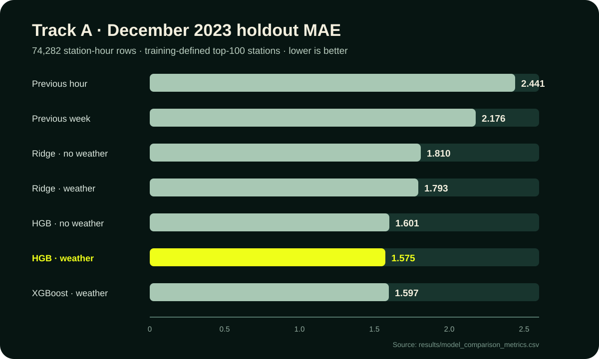
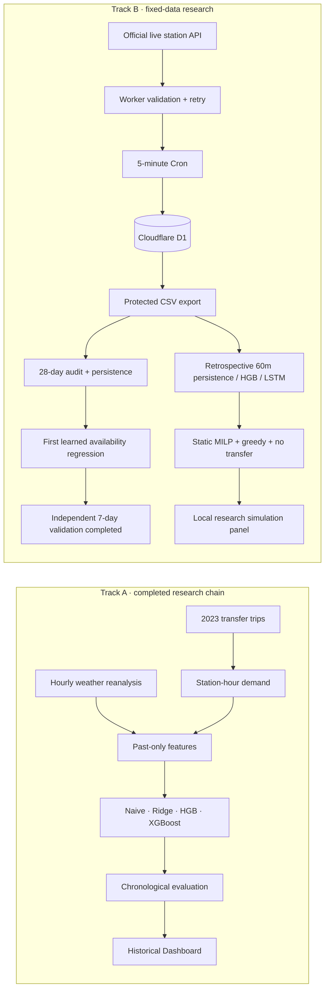

# YouBike Demand Prediction

> Historical transfer-demand forecasting, station-availability comparison, and offline redistribution simulation

**Independent Time-Series Research Project · Research Complete — Implementation Frozen**

This repository is a fixed-data forecasting and redistribution-simulation research prototype. Track A studies historical hourly transfer-related borrowing demand. Track B includes a fixed 28-day availability study, pre-registered independent validation, a supplementary retrospective 60-minute LSTM comparison, and static integer redistribution simulations. Required local acceptance is complete and this implementation is frozen; it is not an operational dispatch or live prediction service. The final changes are local and unpublished.

本專案保留 Track A 歷史需求研究及 Track B 原獨立驗證，另以既有資料完成有界限的 LSTM 比較與靜態整數調度模擬。LSTM 未超越同範圍 HGB；基本調度情境中 MILP 與簡單規則同分。新增研究屬回溯分析，不冒稱新的獨立驗證或真實營運效益。本機必要驗收完成，本版已凍結；尚未 commit、push 或部署。

## Quick links

| Entry | What it contains |
|---|---|
| [Historical Dashboard / 歷史回測展示](dashboard/README.md) | Local Track A holdout demo plus Track B comparison and static simulation panel |
| [中文總覽](docs/PROJECT_OVERVIEW_STATUS_AND_TECHNOLOGY.md) | Complete Traditional Chinese project overview, architecture, evidence, and current status |
| [Track A research summary](docs/STAGE_13_TRACK_A_RESEARCH_SUMMARY.md) | Experiment design, model comparison, rolling-origin validation, ablation, and error analysis |
| [Reproducibility guide](docs/REPRODUCIBILITY.md) | Data, training, inference, dashboard, Track B export, and verification commands |
| [Phase 3–4 results](docs/PHASE_3_4_OFFLINE_RESEARCH.md) | Executed LSTM comparison, static MILP, baselines, costs, sensitivity, and limitations |
| [Freeze and local acceptance](docs/RESEARCH_FREEZE.md) | Scope, actual checks, working-directory manifest, and publication boundary |
| [Track B 28-day learned regression](docs/STAGE_17_TRACK_B_28_DAY_REGRESSION.md) | Fixed-window audit, chronological evaluation, first learned models, and error analysis |
| [Track B collector resilience repair](docs/STAGE_18_TRACK_B_COLLECTOR_RESILIENCE.md) | Production incident, bounded retry changes, deployment evidence, and current monitoring boundary |
| [Track B independent validation and conclusion](docs/STAGE_19_TRACK_B_INDEPENDENT_VALIDATION.md) | Frozen protocol, seven-day results executed September 27, data gates, and cross-window decisions |

The existing hosted dashboard was last page-verified on 2026-09-09. A September 27 read-only Sites lookup reports active/custom access, but the direct hosted request timed out, so current page availability is unverified. No restricted URL is presented as a public demo. The new panel is local-only; source, static bundles, share artwork and local entry point are provided.

## Current status

| Workstream | Status | Evidence-backed scope |
|---|---|---|
| **Track A — historical transfer demand** | Research complete; preserved unchanged | 2023 transfer-related trips, training-defined top-100 stations, chronological holdout, historical dashboard |
| **Track B — station availability** | Original research plus bounded retrospective LSTM comparison executed | Original 30m persistence / 60m modest HGB gain retained; new 64-station comparison does not promote LSTM |
| **Static redistribution simulation** | Research and local display acceptance complete | 12 stations × 12 predefined scenarios; no transfer / greedy / MILP; resources, cost and forecast-error sensitivity |
| **Shortage/full classifier and operational service** | Not in this version | No calibrated risks, causal operational-benefit claim, truck routing or live serving |

Required local acceptance is complete; see the [freeze record](docs/RESEARCH_FREEZE.md) for actual checks and unverified optional checks. Cloud collection is operationally separate and unchanged. Freeze does not mean production-ready or published.

## Results at a glance

### Track A — historical hourly transfer-demand forecasting

- **7,388,479** official 2023 transfer-related trips.
- **100** high-demand stations selected using the training period only.
- Chronological split: January–September training, October–November validation, December holdout.
- Holdout scope: **74,282 station-hour rows**.
- Primary model: HGB with weather — **MAE 1.575, RMSE 2.549, R² 0.794**.
- Rolling-origin HGB MAE: **1.636, 1.592, 1.606**.
- XGBoost was evaluated on the same scope and did not outperform HGB.

繁中摘要：Track A 以 74,282 筆十二月 holdout station-hour rows 評估，HGB with weather 為目前主模型；這些數值只代表定義內的歷史轉乘相關借車需求。

| Model | Holdout MAE | RMSE | R² |
|---|---:|---:|---:|
| Previous hour | 2.441 | 4.129 | 0.460 |
| Previous week, same hour | 2.176 | 3.701 | 0.566 |
| Ridge without weather | 1.810 | 2.911 | 0.731 |
| Ridge with weather | 1.793 | 2.889 | 0.736 |
| HGB without weather | 1.601 | 2.567 | 0.791 |
| **HGB with weather** | **1.575** | **2.549** | **0.794** |
| XGBoost with weather | 1.597 | 2.580 | 0.789 |



*December 2023 holdout, 74,282 rows, training-defined top-100 stations. Lower MAE is better. Source: [`results/model_comparison_metrics.csv`](results/model_comparison_metrics.csv). R² is not an accuracy percentage.*

### Track B — fixed 28-day station-availability regression

Completed analysis window:

```text
[2026-08-21 09:45:02 UTC, 2026-09-18 09:45:02 UTC)
```

| Data-quality measure | Result |
|---|---:|
| Station rows | 14,490,149 |
| Snapshots | 8,058 |
| Distinct stations | 1,803 |
| Duplicate station-time keys | 0 |
| Estimated missing five-minute slots | 7 |
| 30m / 60m future-target coverage | 97.971% / 97.750% |

The fixed chronological split is 18 days training, 5 days validation, and 5 days holdout test. Future labels crossing a boundary are purged. HGB candidates are selected by validation MAE, and the learned model is compared with persistence on identical complete-case test rows.

| Horizon | Model | Test rows | MAE | RMSE | R² |
|---:|---|---:|---:|---:|---:|
| 30m | **Persistence** | 2,518,633 | **2.043** | 3.702 | 0.846 |
| 30m | HGB | 2,518,633 | 2.057 | **3.454** | **0.866** |
| 60m | Persistence | 2,507,965 | 3.012 | 5.190 | 0.697 |
| 60m | **HGB** | 2,507,965 | **2.922** | **4.645** | **0.757** |

At 30 minutes, HGB improves RMSE but is 0.68% worse on MAE, so it does not establish a general improvement over persistence. At 60 minutes, HGB improves MAE by 2.98% and RMSE by 10.51%. These are first fixed-holdout results, not live production or shortage-risk metrics. Track A and Track B have different targets, units, and evaluation scopes and are never placed in one ranking.

繁中摘要：固定 28 天資料有 0 筆重複鍵、估計缺 7 個五分鐘時槽；第一版 HGB 僅在 60 分鐘 MAE 小幅優於 persistence，30 分鐘 MAE 未超越基準，因此尚不可宣稱已完成可靠的即時預測。

### Track B — independent seven-day validation

Executed on **2026-09-27** using unchanged Stage 17 models and pre-registered rules. Evaluation window: `[2026-09-18 18:30 UTC, 2026-09-25 18:30 UTC)`; the preceding hour is feature warm-up only. The evaluation contains 3,636,105 raw station rows, 2,016 / 2,016 expected snapshots, 1,807 observed stations, and zero duplicate station-time keys or missing slots. After eligibility rules, 1,783 stations are evaluated.

| Horizon | Eligible rows | Persistence MAE | Frozen HGB MAE | HGB RMSE vs persistence | Conclusion |
|---:|---:|---:|---:|---|---|
| 30m | 3,567,488 | **1.950** | 1.981 | 3.253 vs 3.455 | Persistence retained; HGB MAE is 1.56% worse |
| 60m | 3,556,778 | 2.862 | **2.813** | 4.389 vs 4.833 | HGB MAE is 1.71% lower; all independent gates pass |

Usable target coverage is 99.696% / 99.397% of active current rows. HGB improves station-level MAE at 34.10% / 58.78% of evaluated stations. The 60m result supports the modest Stage 17 gain; the 30m result does not. These are two fixed-window findings, not a significance claim or a guarantee of long-term performance. Source: [metrics](results/track_b_independent_metrics.csv), [coverage and decisions](results/track_b_independent_summary.json), and [full report / provenance](docs/STAGE_19_TRACK_B_INDEPENDENT_VALIDATION.md).

繁中摘要：獨立驗證不重訓、不調門檻；30 分鐘仍以 persistence 為基準，60 分鐘 HGB 通過事前訂定規則，但改善幅度小，不能包裝成 production-ready 或缺車風險預測。

### Supplementary Phase 3–4 — fixed-data retrospective research

The existing 28-day dataset and 18/5/5-day split are reused. Select 64 stations using training coverage only; compare 60-minute availability on **89,600 common valid sequences**, September 13–18, 2026 (09:45:02 UTC boundaries). HGB and LSTM receive the same 13-step history; new artifacts do not replace Stage 17/19. This previously inspected data is **not a new independent test**.

| Model | MAE (bikes) | RMSE | R² |
|---|---:|---:|---:|
| Persistence | 3.431339 | 6.083467 | 0.676325 |
| HGB, aligned sequence information | **3.249886** | **5.322193** | **0.752265** |
| LSTM, equal-weight three-seed ensemble | 3.326271 | 5.504263 | 0.735025 |

Two preset learning rates, one architecture, three fixed seeds, validation-only selection. **LSTM is not adopted.** The new HGB was selected for simulation before retrospective evaluation. These scope-specific scores are not comparable to the broader Stage 17/19 tables above.

Static MILP uses 12 preselected stations and 12 predetermined decision times. With a 12-bike / 30 bike-km budget, mean objective is **92.1952 without transfer vs 76.8478 for both greedy and MILP**. The 16.65% reduction is in an assumed objective, not measured operational benefit. MILP ties greedy in all base cases; zero-resource and high-cost settings produce no transfer. All 216 plans satisfy the modeled constraints. [Full protocol, seeds, costs, errors and sensitivity](docs/PHASE_3_4_OFFLINE_RESEARCH.md).

繁中摘要：Phase 3／4 已真實執行，不以模型勝出作結案條件。調度只是假設立即搬運的離線模擬；距離是座標代理、成本與半容量目標是研究設定，不是道路路線、缺車機率或真實損失旅次。

## Research tracks

### Track A: problem, data, method, and findings

**Question.** Can station identity, calendar patterns, past demand, and weather predict a station's transfer-related borrowing count for a specified hour?

**Data.** The study uses the official twelve-month 2023 transfer-related YouBike trip dataset and 8,760 hourly Open-Meteo reanalysis observations from one Taipei reference point. It does not cover all YouBike trips.

**Method.** Station selection is training-only. Lag and rolling features look backward. Model choices use validation data, while December remains the final holdout. Compared methods include previous-hour and previous-week baselines, Ridge, Histogram Gradient Boosting, and XGBoost, followed by rolling-origin validation, permutation importance, feature-group ablation, and contextual error analysis.

**Findings.** HGB with weather is the strongest evaluated Track A model. Calendar, recent history, station identity, and daily history carry the most useful signal; weather adds a smaller incremental gain. Errors remain larger during commuting peaks, at high-demand stations, and for high-demand hours. Full evidence is in the [Track A research summary](docs/STAGE_13_TRACK_A_RESEARCH_SUMMARY.md).

### Track B: problem, data infrastructure, and current evidence

**Question.** After enough continuous observations are available, can station inventory be forecast 30 or 60 minutes ahead?

**Data infrastructure.** A Cloudflare Worker fetches the official feed without cache reuse, validates the live schema, retries bounded API failures, and writes five-minute station snapshots to D1. A database primary key prevents duplicate station-time rows; structured run logs, safe response diagnostics, and a protected, paginated CSV export support audit and Python analysis. Local collectors remain testing and fallback tools, not the formal long-running solution.

**Current evidence.** The fixed 28-day window passed its audit with seven isolated missing slots. Regularized HGB uses current state, location, Taipei calendar, past-only lag, and rolling features. The unchanged models were independently evaluated on September 27: 30m still does not beat persistence on MAE; 60m passes the pre-registered gates and shows a modest improvement in both windows. Full evidence is in the [Stage 17 report](docs/STAGE_17_TRACK_B_28_DAY_REGRESSION.md) and [Stage 19 results](docs/STAGE_19_TRACK_B_INDEPENDENT_VALIDATION.md). Collection continues; this is not a deployed prediction service.

### Version boundary and stop rule

The owner explicitly replaced the v5 deferral of Deep Learning/Optimization with a bounded fixed-data study. After local acceptance, this version stops development: no automatic new models, windows, tuning, deployment, monitoring or research stages. Risk classification, real fleet constraints, causal validation and seasonal generalization are outside this version, not queued work. Reopening requires an explicit owner request.

## Architecture and technology


```mermaid
flowchart LR
  subgraph A[Track A · completed research chain]
    A1[2023 transfer trips] --> A2[Station-hour demand]
    A3[Hourly weather reanalysis] --> A4[Past-only features]
    A2 --> A4 --> A5[Naive · Ridge · HGB · XGBoost]
    A5 --> A6[Chronological evaluation]
    A6 --> A7[Historical Dashboard]
  end

  subgraph B[Track B · fixed-data research]
    B1[Official live station API] --> B2[Worker validation + retry]
    B2 --> B3[5-minute Cron]
    B3 --> B4[(Cloudflare D1)]
    B4 --> B5[Protected CSV export]
    B5 --> B6[28-day audit + persistence]
    B6 --> B7[First learned availability regression]
    B7 --> B8[Independent 7-day validation completed]
    B5 --> B9[Retrospective 60m persistence / HGB / LSTM]
    B9 --> B10[Static MILP + greedy + no transfer]
    B10 --> B11[Local research simulation panel]
  end
```

| Technology | Purpose in this project |
|---|---|
| Python, pandas, NumPy | Data validation, station-hour aggregation, time alignment, feature engineering, and analysis |
| scikit-learn | Ridge and Histogram Gradient Boosting pipelines and evaluation |
| XGBoost | Controlled tree-model comparison on the Track A scope |
| PyTorch, SciPy/HiGHS MILP | Bounded LSTM sequence comparison and constrained integer-transfer simulation |
| Jupyter, Matplotlib | Executed research notebooks and evidence visualization |
| Cloudflare Worker, Cron, D1 | Long-running Track B collection, validation, logging, deduplication, and storage |
| React 19, Vinext, TypeScript, Vite | Interactive historical holdout dashboard |
| Python `unittest`, Node test runner | Data, feature, model, export, and collector checks |

## Minimal local start and verification

```bash
python3 -m venv .venv
source .venv/bin/activate
python -m pip install -r requirements-research.txt
python -m unittest discover -s tests -v
```

Run the Historical Dashboard locally:

```bash
cd dashboard
pnpm install
pnpm run dev
```

Detailed data preparation, training, inference, Track B export, audit, and dashboard checks are centralized in the [reproducibility guide](docs/REPRODUCIBILITY.md).

## Evidence map

| Evidence | Document or artifact |
|---|---|
| Track A consolidated design and findings | [Research summary](docs/STAGE_13_TRACK_A_RESEARCH_SUMMARY.md) |
| Full holdout model table | [`model_comparison_metrics.csv`](results/model_comparison_metrics.csv) |
| Rolling-origin stability | [HGB metrics](results/tree_rolling_origin_metrics.csv) · [XGBoost metrics](results/xgboost_rolling_origin_metrics.csv) |
| Feature-group ablation and contextual errors | [Analysis report](docs/STAGE_12_FEATURE_ABLATION_ERROR_ANALYSIS.md) |
| Model scope and artifact integrity | [Model card](docs/MODEL_CARD.md) |
| Historical prediction interface | [Prediction guide](docs/STAGE_8_PREDICTION_INTERFACE.md) |
| Historical Dashboard | [Dashboard guide](docs/STAGE_9_HISTORICAL_DASHBOARD.md) |
| Track B cloud architecture | [Collection and deployment record](docs/STAGE_11_TRACK_B_CLOUD_COLLECTION.md) |
| Track B seven-day historical checkpoint | [Audit](docs/STAGE_14_TRACK_B_FIRST_COVERAGE_AUDIT.md) · [Preliminary baseline](docs/STAGE_15_TRACK_B_PRELIMINARY_BASELINE.md) |
| Track B fourteen-day historical checkpoint | [Stability analysis](docs/STAGE_16_TRACK_B_14_DAY_STABILITY.md) |
| Track B first learned-model checkpoint | [28-day audit and learned regression](docs/STAGE_17_TRACK_B_28_DAY_REGRESSION.md) |
| Track B current completed checkpoint | [Independent validation and cross-window conclusion](docs/STAGE_19_TRACK_B_INDEPENDENT_VALIDATION.md) |
| Supplementary deep learning and optimization | [Phase 3–4 report](docs/PHASE_3_4_OFFLINE_RESEARCH.md) · [offline model card](docs/TRACK_B_OFFLINE_MODEL_CARD.md) |

## Scope and limitations

- Track A predicts **hourly transfer-related borrowing demand**, not all YouBike trips or current station inventory.
- The Track A scope is limited to 100 stations selected from training-period activity.
- Historical weather is reanalysis from one Taipei reference point. Future deployment requires weather information available at prediction time.
- Peak hours, high-demand stations, and high-demand events retain larger errors.
- The Track A panel shows 10 representative December holdout times, not the full 74,282-row test set. The new Track B panel shows recorded forecasts and simulations, not live station inventory.
- R² is not converted to an “accuracy” percentage, and demand rankings are not redistribution recommendations.
- Track B snapshot changes mix rentals, returns, operational redistribution, and data corrections.
- The original 28-day window has seven missing five-minute slots; the independent seven-day window has none. Neither establishes seasonal or long-term stability.
- Complete scheduling does not guarantee fresh upstream inventory: four independent snapshots have source updates over five minutes older than their scheduled timestamps (maximum 18.2 minutes).
- The 30-minute learned model does not beat persistence on MAE, and the 60-minute gain is modest.
- No shortage/full-station classifier, operational optimizer, or production-ready live prediction is claimed.
- Supplementary LSTM results are retrospective, limited to 64 stations, and do not erase prior exposure. Static redistribution assumes immediate additive transfers, usable modeled empty capacity and synthetic costs; it does not establish real-world benefit.

繁中限制摘要：Track A 不是全部旅次或即時庫存；Track B 尚無可靠的 30 分鐘 MAE 改善、缺車／滿站分類或營運服務。已完成的是固定資料比較與調度模擬，不能把目標函數改善宣稱為真實營運效益。

## Data sources and licensing

- [2023 transfer-related YouBike trip dataset](https://data.gov.tw/dataset/169174) — Government Data Open License, Taiwan, version 1.0; source-specific details are recorded in [`config/historical_sources.json`](config/historical_sources.json).
- [Taipei City YouBike 2.0 real-time dataset](https://data.taipei/dataset/detail?id=c6bc8aed-557d-41d5-bfb1-8da24f78f2fb) — official live station source; consult the source page for current terms.
- [Open-Meteo Historical Weather API](https://open-meteo.com/en/docs/historical-weather-api) — one Taipei reanalysis grid point; consult the provider documentation for current attribution and licensing requirements.
- Repository code and original documentation are released under the [MIT License](LICENSE). Upstream datasets retain their own terms and are not relicensed by this repository.

## Project state

- **Documentation updated:** 2026-09-27
- **Original 28-day analysis window:** `[2026-08-21 09:45:02 UTC, 2026-09-18 09:45:02 UTC)`
- **Completed independent evaluation window:** `[2026-09-18 18:30 UTC, 2026-09-25 18:30 UTC)`
- **Last verified cloud checkpoint:** observed September 27; latest snapshot 2026-09-27 01:00:28 Asia/Taipei, successful run completed at 01:00:48 with one attempt and 1,807 stations; 10,450 cumulative snapshots and 18,805,167 cumulative station rows

The cloud checkpoint is a dated observation, not a continuously refreshed total or proof that every past attempt succeeded. This round did not query, restart or redeploy the collector. The original 28-day audit, Stage 17/19 models/results, Track A results and Track A Dashboard bundle are unchanged. The new research panel is local-only, not published.
