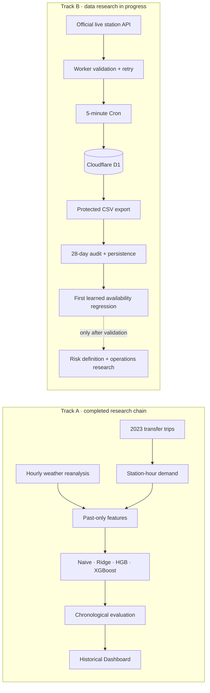

# YouBike Demand Prediction

> Historical transfer-demand forecasting and ongoing station-availability research

**Independent Time-Series Research Project · In Progress**

This repository contains two separate time-series studies built around Taipei YouBike data. Track A forecasts historical hourly transfer-related borrowing demand and has completed its main evaluation and dashboard. Track B collects live station inventory in the cloud and has completed a fixed 28-day audit plus its first learned 30/60-minute availability regression.

本專案包含兩條不可混用目標的研究線：Track A 已完成歷史轉乘需求預測的主要研究與回測展示；Track B 已完成固定 28 天資料稽核與第一版 learned regression。30 分鐘模型尚未在 MAE 超越 persistence，60 分鐘僅呈現小幅改善；缺車／滿站風險與調度最佳化仍未實作。

## Quick links

| Entry | What it contains |
|---|---|
| [Historical Dashboard / 歷史回測展示](dashboard/README.md) | Local launch instructions and the scope of the 10-timepoint historical holdout demo |
| [中文總覽](docs/PROJECT_OVERVIEW_STATUS_AND_TECHNOLOGY.md) | Complete Traditional Chinese project overview, architecture, evidence, and current status |
| [Track A research summary](docs/STAGE_13_TRACK_A_RESEARCH_SUMMARY.md) | Experiment design, model comparison, rolling-origin validation, ablation, and error analysis |
| [Reproducibility guide](docs/REPRODUCIBILITY.md) | Data, training, inference, dashboard, Track B export, and verification commands |
| [Track B 28-day learned regression](docs/STAGE_17_TRACK_B_28_DAY_REGRESSION.md) | Fixed-window audit, chronological evaluation, first learned models, and error analysis |
| [Track B collector resilience repair](docs/STAGE_18_TRACK_B_COLLECTOR_RESILIENCE.md) | Production incident, bounded retry changes, deployment evidence, and current monitoring boundary |
| [Track B independent validation protocol](docs/STAGE_19_TRACK_B_INDEPENDENT_VALIDATION.md) | Frozen models, pre-registered 7-day window, pass/fail rules, and the 9/26 execution command |

The existing hosted dashboard deployment was verified on 2026-09-09 but remains owner-restricted. No inaccessible URL is presented here as a public demo; the repository provides its source, static bundle, share artwork, and local entry point.

## Current status

| Workstream | Status | Evidence-backed scope |
|---|---|---|
| **Track A — historical transfer demand** | Main research and evaluation complete; maintenance | 2023 transfer-related trips, training-defined top-100 stations, chronological holdout, historical dashboard |
| **Track B — station availability** | First learned baseline complete; independent validation pre-registered | Fixed 28-day audit and 30/60-minute HGB evaluation complete; frozen 7-day temporal validation runs after 2026-09-26 02:30 Asia/Taipei |
| **Shortage/full risk and redistribution** | Not implemented | Requires a validated availability forecast, explicit risk costs, and operational constraints |

The repository as a whole is not marked completed, frozen, or production-ready.

## Results at a glance

### Track A — historical hourly transfer-demand forecasting

- **7,388,479** official 2023 transfer-related trips.
- **100** high-demand stations selected using the training period only.
- Chronological split: January–September training, October–November validation, December holdout.
- Holdout scope: **74,282 station-hour rows**.
- Primary model: HGB with weather — **MAE 1.575, RMSE 2.549, R² 0.794**.
- Rolling-origin HGB MAE: **1.636, 1.592, 1.606**.
- XGBoost was evaluated on the same scope and did not outperform HGB.

繁中摘要：Track A 以 74,282 筆十二月 holdout station-hour rows 評估，HGB with weather 為目前主模型；這些數值只代表定義內的歷史轉乘相關借車需求。

| Model | Holdout MAE | RMSE | R² |
|---|---:|---:|---:|
| Previous hour | 2.441 | 4.129 | 0.460 |
| Previous week, same hour | 2.176 | 3.701 | 0.566 |
| Ridge without weather | 1.810 | 2.911 | 0.731 |
| Ridge with weather | 1.793 | 2.889 | 0.736 |
| HGB without weather | 1.601 | 2.567 | 0.791 |
| **HGB with weather** | **1.575** | **2.549** | **0.794** |
| XGBoost with weather | 1.597 | 2.580 | 0.789 |


*December 2023 holdout, 74,282 rows, training-defined top-100 stations. Lower MAE is better. Source: [`results/model_comparison_metrics.csv`](results/model_comparison_metrics.csv). R² is not an accuracy percentage.*

### Track B — fixed 28-day station-availability regression

Completed analysis window:

```text
[2026-08-21 09:45:02 UTC, 2026-09-18 09:45:02 UTC)
```

| Data-quality measure | Result |
|---|---:|
| Station rows | 14,490,149 |
| Snapshots | 8,058 |
| Distinct stations | 1,803 |
| Duplicate station-time keys | 0 |
| Estimated missing five-minute slots | 7 |
| 30m / 60m future-target coverage | 97.971% / 97.750% |

The fixed chronological split is 18 days training, 5 days validation, and 5 days holdout test. Future labels crossing a boundary are purged. HGB candidates are selected by validation MAE, and the learned model is compared with persistence on identical complete-case test rows.

| Horizon | Model | Test rows | MAE | RMSE | R² |
|---:|---|---:|---:|---:|---:|
| 30m | **Persistence** | 2,518,633 | **2.043** | 3.702 | 0.846 |
| 30m | HGB | 2,518,633 | 2.057 | **3.454** | **0.866** |
| 60m | Persistence | 2,507,965 | 3.012 | 5.190 | 0.697 |
| 60m | **HGB** | 2,507,965 | **2.922** | **4.645** | **0.757** |

At 30 minutes, HGB improves RMSE but is 0.68% worse on MAE, so it does not establish a general improvement over persistence. At 60 minutes, HGB improves MAE by 2.98% and RMSE by 10.51%. These are first fixed-holdout results, not live production or shortage-risk metrics. Track A and Track B have different targets, units, and evaluation scopes and are never placed in one ranking.

繁中摘要：固定 28 天資料有 0 筆重複鍵、估計缺 7 個五分鐘時槽；第一版 HGB 僅在 60 分鐘 MAE 小幅優於 persistence，30 分鐘 MAE 未超越基準，因此尚不可宣稱已完成可靠的即時預測。

## Research tracks

### Track A: problem, data, method, and findings

**Question.** Can station identity, calendar patterns, past demand, and weather predict a station's transfer-related borrowing count for a specified hour?

**Data.** The study uses the official twelve-month 2023 transfer-related YouBike trip dataset and 8,760 hourly Open-Meteo reanalysis observations from one Taipei reference point. It does not cover all YouBike trips.

**Method.** Station selection is training-only. Lag and rolling features look backward. Model choices use validation data, while December remains the final holdout. Compared methods include previous-hour and previous-week baselines, Ridge, Histogram Gradient Boosting, and XGBoost, followed by rolling-origin validation, permutation importance, feature-group ablation, and contextual error analysis.

**Findings.** HGB with weather is the strongest evaluated Track A model. Calendar, recent history, station identity, and daily history carry the most useful signal; weather adds a smaller incremental gain. Errors remain larger during commuting peaks, at high-demand stations, and for high-demand hours. Full evidence is in the [Track A research summary](docs/STAGE_13_TRACK_A_RESEARCH_SUMMARY.md).

### Track B: problem, data infrastructure, and current evidence

**Question.** After enough continuous observations are available, can station inventory be forecast 30 or 60 minutes ahead?

**Data infrastructure.** A Cloudflare Worker fetches the official feed without cache reuse, validates the live schema, retries bounded API failures, and writes five-minute station snapshots to D1. A database primary key prevents duplicate station-time rows; structured run logs, safe response diagnostics, and a protected, paginated CSV export support audit and Python analysis. Local collectors remain testing and fallback tools, not the formal long-running solution.

**Current evidence.** The fixed 28-day window passed duplicate, coverage, timestamp, and target-alignment checks with seven isolated missing slots. The first regularized HGB models use current state, location, Taipei calendar, past-only lag, and rolling features. The 30-minute model does not beat persistence on MAE; the 60-minute result is a modest improvement. Their artifacts and a future seven-day validation window are now frozen before export; execution begins after 2026-09-26 02:30 Asia/Taipei. Full evidence is in the [Stage 17 report](docs/STAGE_17_TRACK_B_28_DAY_REGRESSION.md) and [Stage 19 protocol](docs/STAGE_19_TRACK_B_INDEPENDENT_VALIDATION.md).

### Conditional future research

1. Execute the pre-registered independent window without retraining or changing gates.
2. Freeze the final 30/60-minute conclusion from Stage 17 plus the independent result.
3. Define shortage/full-station labels and the costs of false alarms and missed events before classification.
4. Evaluate redistribution methods only after risk predictions, operational constraints, and decision objectives are explicit.

The 28-day milestone has been executed; reaching the date alone was not treated as success. Deep learning and reinforcement learning are not assumed requirements.

## Architecture and technology


```mermaid
flowchart LR
  subgraph A[Track A · completed research chain]
    A1[2023 transfer trips] --> A2[Station-hour demand]
    A3[Hourly weather reanalysis] --> A4[Past-only features]
    A2 --> A4 --> A5[Naive · Ridge · HGB · XGBoost]
    A5 --> A6[Chronological evaluation]
    A6 --> A7[Historical Dashboard]
  end

  subgraph B[Track B · data research in progress]
    B1[Official live station API] --> B2[Worker validation + retry]
    B2 --> B3[5-minute Cron]
    B3 --> B4[(Cloudflare D1)]
    B4 --> B5[Protected CSV export]
    B5 --> B6[28-day audit + persistence]
    B6 --> B7[First learned availability regression]
    B7 -. only after validation .-> B8[Risk definition + operations research]
  end
```

| Technology | Purpose in this project |
|---|---|
| Python, pandas, NumPy | Data validation, station-hour aggregation, time alignment, feature engineering, and analysis |
| scikit-learn | Ridge and Histogram Gradient Boosting pipelines and evaluation |
| XGBoost | Controlled tree-model comparison on the Track A scope |
| Jupyter, Matplotlib | Executed research notebooks and evidence visualization |
| Cloudflare Worker, Cron, D1 | Long-running Track B collection, validation, logging, deduplication, and storage |
| React 19, Vinext, TypeScript, Vite | Interactive historical holdout dashboard |
| Python `unittest`, Node test runner | Data, feature, model, export, and collector checks |

## Minimal local start and verification

```bash
python3 -m venv .venv
source .venv/bin/activate
python -m pip install -r requirements.txt
python -m unittest discover -s tests -v
```

Run the Historical Dashboard locally:

```bash
cd dashboard
pnpm install
pnpm run dev
```

Detailed data preparation, training, inference, Track B export, audit, and dashboard checks are centralized in the [reproducibility guide](docs/REPRODUCIBILITY.md).

## Evidence map

| Evidence | Document or artifact |
|---|---|
| Track A consolidated design and findings | [Research summary](docs/STAGE_13_TRACK_A_RESEARCH_SUMMARY.md) |
| Full holdout model table | [`model_comparison_metrics.csv`](results/model_comparison_metrics.csv) |
| Rolling-origin stability | [HGB metrics](results/tree_rolling_origin_metrics.csv) · [XGBoost metrics](results/xgboost_rolling_origin_metrics.csv) |
| Feature-group ablation and contextual errors | [Analysis report](docs/STAGE_12_FEATURE_ABLATION_ERROR_ANALYSIS.md) |
| Model scope and artifact integrity | [Model card](docs/MODEL_CARD.md) |
| Historical prediction interface | [Prediction guide](docs/STAGE_8_PREDICTION_INTERFACE.md) |
| Historical Dashboard | [Dashboard guide](docs/STAGE_9_HISTORICAL_DASHBOARD.md) |
| Track B cloud architecture | [Collection and deployment record](docs/STAGE_11_TRACK_B_CLOUD_COLLECTION.md) |
| Track B seven-day historical checkpoint | [Audit](docs/STAGE_14_TRACK_B_FIRST_COVERAGE_AUDIT.md) · [Preliminary baseline](docs/STAGE_15_TRACK_B_PRELIMINARY_BASELINE.md) |
| Track B fourteen-day historical checkpoint | [Stability analysis](docs/STAGE_16_TRACK_B_14_DAY_STABILITY.md) |
| Track B current completed checkpoint | [28-day audit and first learned regression](docs/STAGE_17_TRACK_B_28_DAY_REGRESSION.md) |
| Track B next fixed checkpoint | [Pre-registered independent validation](docs/STAGE_19_TRACK_B_INDEPENDENT_VALIDATION.md) |

## Scope and limitations

- Track A predicts **hourly transfer-related borrowing demand**, not all YouBike trips or current station inventory.
- The Track A scope is limited to 100 stations selected from training-period activity.
- Historical weather is reanalysis from one Taipei reference point. Future deployment requires weather information available at prediction time.
- Peak hours, high-demand stations, and high-demand events retain larger errors.
- The Dashboard shows 10 representative December holdout times, not the full 74,282-row test set or live station inventory.
- R² is not converted to an “accuracy” percentage, and demand rankings are not redistribution recommendations.
- Track B snapshot changes mix rentals, returns, operational redistribution, and data corrections.
- Twenty-eight days still do not establish seasonal or long-term stability; seven five-minute slots are missing.
- The 30-minute learned model does not beat persistence on MAE, and the 60-minute gain is modest.
- No shortage/full-station classifier, operational optimizer, or production-ready live prediction is claimed.

繁中限制摘要：Track A 不是全部旅次或即時庫存，Dashboard 也只是十個歷史回測時段；Track B 已有第一版 learned regression，但尚未完成可靠的 30 分鐘改善、缺車／滿站分類或調度最佳化。

## Data sources and licensing

- [2023 transfer-related YouBike trip dataset](https://data.gov.tw/dataset/169174) — Government Data Open License, Taiwan, version 1.0; source-specific details are recorded in [`config/historical_sources.json`](config/historical_sources.json).
- [Taipei City YouBike 2.0 real-time dataset](https://data.taipei/dataset/detail?id=c6bc8aed-557d-41d5-bfb1-8da24f78f2fb) — official live station source; consult the source page for current terms.
- [Open-Meteo Historical Weather API](https://open-meteo.com/en/docs/historical-weather-api) — one Taipei reanalysis grid point; consult the provider documentation for current attribution and licensing requirements.
- Repository code and original documentation are released under the [MIT License](LICENSE). Upstream datasets retain their own terms and are not relicensed by this repository.

## Project state

- **Documentation updated:** 2026-09-19
- **Completed analysis window:** `[2026-08-21 09:45:02 UTC, 2026-09-18 09:45:02 UTC)`
- **Last verified cloud checkpoint:** 2026-09-19 02:00:03 Asia/Taipei — nine consecutive post-deployment scheduled runs succeeded on attempt 1 with 1,803 stations; 8,158 cumulative snapshots and 14,670,350 cumulative station rows

The cloud checkpoint is a dated observation, not a continuously refreshed total. Worker version `30e22fe9-9d56-48d1-9cb3-c84c551112d2` restored collection after a sequence of malformed-response failures; nine consecutive successful runs still do not replace long-term monitoring. The fixed 28-day analysis ends before this incident, so its audit and model metrics are unchanged.
