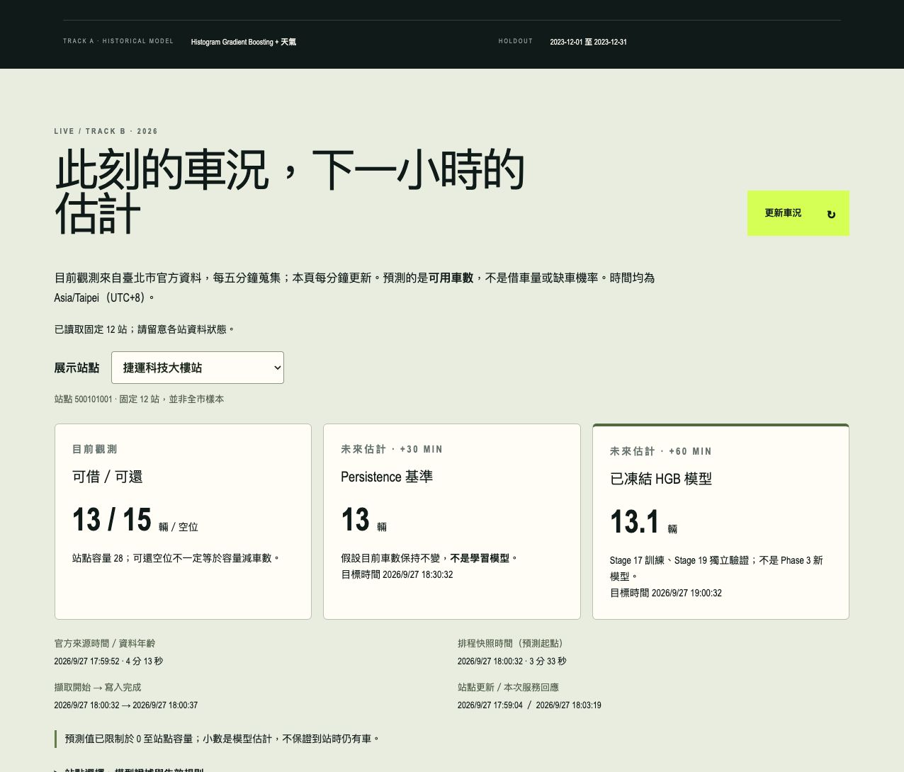
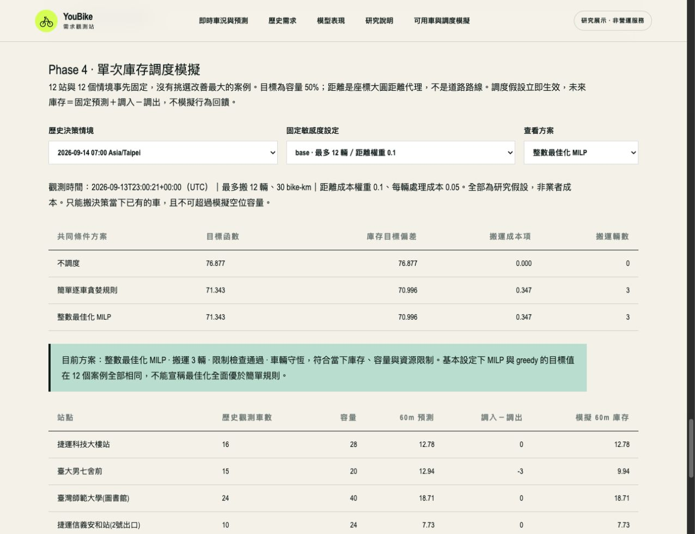
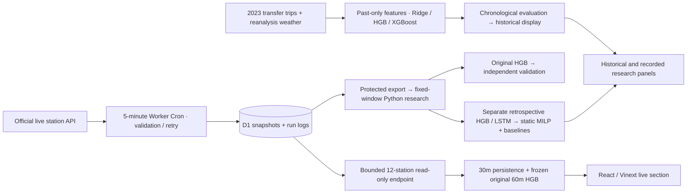

# YouBike Demand Prediction

Station-demand analysis, short-term bike-availability forecasting, and static redistribution simulation.

Independent Time-Series Research Project · Research & Demonstration Complete · Implementation Frozen

I study two related questions: how much transfer-related borrowing a station sees in an hour, and how many bikes it may have 30 or 60 minutes later. A separate simulation compares redistribution methods under fixed assumptions. The public website brings these results together without treating them as one model pipeline.

個人自主時間序列研究作品：歷史需求、短期可用車預測與靜態調度模擬。研究與展示已完成，實作凍結；保留未勝出的模型結果，不把模擬改善當作營運收益。

[Open the demo / 開啟展示](https://youbike-demand-observatory.rwhqgqfdk2.chatgpt.site/#live) ·
[中文總覽](docs/PROJECT_OVERVIEW_STATUS_AND_TECHNOLOGY.md) ·
[Core findings / 核心成果](#core-findings) ·
[Reproduce / 重現方式](docs/REPRODUCIBILITY.md)

## Core findings

| Study | Result | Evaluation scope |
|---|---|---|
| Historical demand — Track A | HGB with weather: holdout MAE **1.575** | 2023 transfer-related borrowing; 100 training-selected stations; 74,282 December station-hour rows |
| Short-term availability — Track B | Retain persistence at 30m; 60m HGB lowers MAE by **1.71%** | Independent seven-day validation, September 18–25, 2026 UTC; 1,783 evaluated stations; identical eligible rows per horizon |
| Deep-learning comparison | LSTM did not beat the aligned HGB and was not adopted | Separate retrospective 60m comparison: 64 stations, 89,600 common sequences, September 13–18, 2026 UTC |
| Static redistribution | MILP ties greedy in all base cases; both reduce the assumed objective by **16.65%** versus no transfer | 12 fixed stations × 12 predefined historical scenarios; not measured operational benefit |

Sources: [Track A metrics](results/model_comparison_metrics.csv), [independent Track B metrics](results/track_b_independent_metrics.csv), [LSTM comparison](results/offline_research/comparison.csv), and [simulation comparison](results/offline_research/optimization_comparison.csv). Exact periods and protocols are below; scores from different scopes are not a shared leaderboard.

### Current observations and future estimates



Actual published interface, captured September 27, 2026. The station selector covers all 12 preselected stations; this image shows the first, 捷運科技大樓站. The snapshot origin is 18:00:32 Asia/Taipei; forecast targets are 18:30:32 and 19:00:32. This is a dated screenshot, not a live feed or accuracy result. [Capture details](docs/assets/README.md).

### Recorded static simulation



Actual published interface: September 14, 2026, 07:00 Asia/Taipei, the first predefined scenario, with the base 12-bike / 30 bike-km budget. Its objective values are 76.877 without transfer and 71.343 for either active method. The 16.65% headline is the mean-objective reduction across all 12 base scenarios, not this single case. These are hypothetical transfers, not live dispatch instructions.

### Historical holdout comparison


December 2023, 74,282 station-hour rows across 100 training-selected stations; lower MAE is better. The existing figure uses [saved model metrics](results/model_comparison_metrics.csv), not the live station data. R² is not an accuracy percentage.

## Research questions, methods and conclusions

### Track A — hourly transfer-related borrowing

Can calendar, station identity, past demand and weather explain hourly borrowing demand?

The dataset contains 7,388,479 official 2023 transfer-related trips, joined with 8,760 hours of Open-Meteo reanalysis weather. It does not cover all YouBike trips. Stations are selected using training activity only. January–September is training, October–November validation, and December holdout. Lag and rolling features use past demand.

HGB with weather achieved MAE 1.575, RMSE 2.549 and R² 0.794. Its three rolling-origin MAEs are 1.636, 1.592 and 1.606. XGBoost was evaluated but did not outperform HGB. Calendar and historical demand carry more signal than weather; peak hours and high-demand stations remain harder to predict. [Research summary, ablation and error analysis](docs/STAGE_13_TRACK_A_RESEARCH_SUMMARY.md).

### Track B — available bikes in 30 or 60 minutes

Does a learned model improve on assuming that current station inventory stays unchanged?

The first study uses `[2026-08-21 09:45:02 UTC, 2026-09-18 09:45:02 UTC)`: 14,490,149 station rows, 8,058 snapshots, 1,803 stations, no duplicate station-time keys and seven estimated missing five-minute slots. The chronological split is 18/5/5 days. Targets crossing split boundaries are purged; HGB is selected on validation data.

The unchanged models were then evaluated on `[2026-09-18 18:30 UTC, 2026-09-25 18:30 UTC)`, with an earlier hour used only for feature warm-up. This independent window contains 3,636,105 raw rows and all 2,016 expected snapshots. Eligible comparisons use 3,567,488 rows at 30m and 3,556,778 at 60m, covering 1,783 stations.

- At 30m, persistence MAE is 1.950 versus HGB 1.981: retain persistence.
- At 60m, HGB MAE is 2.813 versus persistence 2.862: a modest 1.71% improvement, consistent with the earlier holdout direction.
- These are fixed-window results, not evidence of continuous learning, seasonal generalization or statistical significance.

The live section serves the original Stage 17 HGB validated in Stage 19, not a replacement from the later LSTM experiment. [Initial study](docs/STAGE_17_TRACK_B_28_DAY_REGRESSION.md) · [Independent protocol and results](docs/STAGE_19_TRACK_B_INDEPENDENT_VALIDATION.md).

### LSTM and static redistribution — separate retrospective experiments

The existing 28-day data are reused for a 64-station, 60m comparison with 13-step history. On 89,600 common sequences in `[2026-09-13 09:45:02 UTC, 2026-09-18 09:45:02 UTC)`, LSTM ensemble MAE is 3.326271 versus aligned HGB 3.249886. Two preset learning rates and three fixed seeds were compared using validation-only selection. LSTM was not adopted; previously inspected data are not presented as a new independent test.

The validation-selected retrospective HGB supplies the static simulator. Twelve stations are selected from training-period coordinates, and twelve decision times are fixed in advance: September 14–17 at 07:00, 12:00 and 17:00 Asia/Taipei. Base mean objective is 92.1952 without transfer and 76.8478 for both greedy and MILP. All 216 saved plans across resource/cost variants pass the modeled constraints; zero resources or high cost can make no transfer the best result. [Full methods, negative results and sensitivity](docs/PHASE_3_4_OFFLINE_RESEARCH.md).

繁中解讀：Track A 預測每站每小時轉乘相關借車量；Track B 預測未來庫存。Track A 的輸出不直接輸入 Track B 或調度。庫存差值不等於實際借車量；Phase 4 是固定假設的歷史模擬。

## Architecture and technology


```mermaid
flowchart LR
  A["2023 transfer trips + reanalysis weather"] --> AF["Past-only features · Ridge / HGB / XGBoost"]
  AF --> AH["Chronological evaluation → historical display"]
  B["Official live station API"] --> C["5-minute Worker Cron · validation / retry"]
  C --> D[("D1 snapshots + run logs")]
  D --> E["Protected export → fixed-window Python research"]
  E --> V["Original HGB → independent validation"]
  E --> R["Separate retrospective HGB / LSTM → static MILP + baselines"]
  D --> L["Bounded 12-station read-only endpoint"]
  L --> F["30m persistence + frozen original 60m HGB"]
  F --> UI["React / Vinext live section"]
  AH --> UI2["Historical and recorded research panels"]
  R --> UI2
```

| Technology | Use |
|---|---|
| Python, pandas, NumPy | Cleaning, time alignment, past-only features, audit and analysis |
| scikit-learn, XGBoost | Baselines, HGB and controlled Track A comparison |
| PyTorch | Bounded LSTM experiment; not the deployed predictor |
| SciPy / HiGHS | Integer redistribution with conservation, stock, capacity and resource constraints |
| Cloudflare Workers, Cron, D1 | Collection, deduplication, run logs, protected CSV export and server-side inference |
| React 19, Vinext, TypeScript | Live observations/estimates, historical holdout and recorded simulation panels |
| unittest, Node tests, SHA-256 manifests | Automated checks and traceable data/model/delivery artifacts |

D1 stores UTC timestamps; calendar features and displayed times use Asia/Taipei. The public endpoint returns only 12-station summaries, not export credentials or full history. The page refreshes each minute; collection runs every five minutes. Stale or invalid data suppress forecasts with a reason. The local collector remains a testing/debugging fallback.

### Evidence index

| Topic | Entry |
|---|---|
| Research design and full experiment history | [Documentation index](docs/README.md) |
| Track A results and limitations | [Research summary](docs/STAGE_13_TRACK_A_RESEARCH_SUMMARY.md) · [Model card](docs/MODEL_CARD.md) |
| Track B fixed-window and independent results | [28-day study](docs/STAGE_17_TRACK_B_28_DAY_REGRESSION.md) · [Seven-day validation](docs/STAGE_19_TRACK_B_INDEPENDENT_VALIDATION.md) |
| LSTM, simulation and negative results | [Phase 3–4 report](docs/PHASE_3_4_OFFLINE_RESEARCH.md) · [Offline model card](docs/TRACK_B_OFFLINE_MODEL_CARD.md) |
| Live inference contract and use | [Serving protocol](docs/LIVE_DEMO_PROTOCOL.md) · [Dashboard guide](dashboard/README.md) |
| Exact deployed versions and executed acceptance | [September 27 delivery record](docs/LIVE_DEMO_DELIVERY.md) |
| Original freeze and later documentation changes | [Documentation revision and integrity](docs/DOCUMENTATION_REVISION.md) |

## Run locally

To view the website, no training or dataset export is needed:

```bash
cd dashboard
pnpm install --frozen-lockfile
pnpm run dev
```

Open the local URL printed by the server. Historical panels work without the live API; only the live section needs network access. Verification from the repository root:

```bash
python3 scripts/verify_publication.py
python3 -m unittest tests.test_publication_integrity -v
```

Research environments, data preparation, protected export, model reproduction and full software tests are documented in the [reproducibility guide](docs/REPRODUCIBILITY.md). Reproduction is separate from viewing the demo and must not overwrite frozen artifacts.

## Scope and limitations

- Track A covers transfer-related trips at 100 selected stations in 2023. Single-point reanalysis weather is retrospective; future use would need weather available at prediction time. The website shows ten holdout timepoints, not the full test set.
- Track B inventory changes mix rentals, returns, redistribution and corrections. Five-minute collection does not guarantee fresh upstream observations. Its small 60m gain does not establish seasonal robustness or improvement at every station.
- Live observations, future estimates and recorded simulation are separate. Forecast targets are measured from the scheduled snapshot, not page-load time; unavailable is not zero.
- Static transfers assume immediate effects, usable modeled empty capacity, a half-capacity target and synthetic distance/cost penalties. No causal benefit, calibrated shortage/full-station risk, truck routing or arrival-time guarantee is claimed.
- The research and demonstration are complete and frozen. The original collector may continue operating independently; hosting, API availability and storage still require maintenance.

## Data and licensing

- [Official 2023 transfer-related trips](https://data.gov.tw/dataset/169174): Government Data Open License, Taiwan, version 1.0; source details in [historical sources](config/historical_sources.json).
- [Taipei YouBike 2.0 live data](https://data.taipei/dataset/detail?id=c6bc8aed-557d-41d5-bfb1-8da24f78f2fb): official station feed; upstream terms apply.
- [Open-Meteo historical weather](https://open-meteo.com/en/docs/historical-weather-api): one Taipei reanalysis reference point; provider attribution and terms apply.
- Original code/documentation use the [MIT License](LICENSE). Upstream datasets retain their own rights. Screenshots show this project's actual interface and are demonstration material, not new evaluation evidence.
