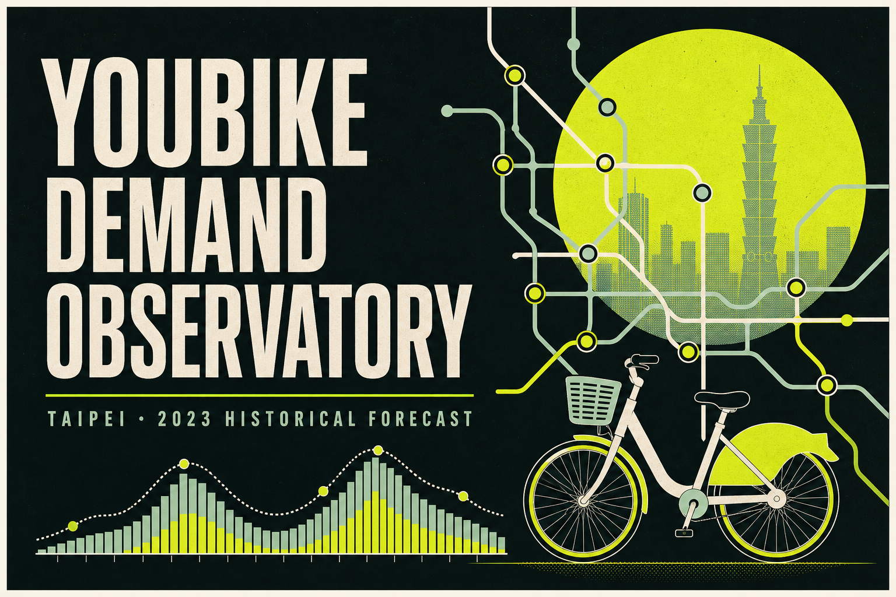

# Historical Dashboard／歷史回測展示

This React 19 + Vinext interface explores 10 representative timepoints from the December 2023 Track A holdout. It reads the checked-in static prediction bundle and shows predictions, post-inference actual values, errors, model comparisons, rolling-origin results, and feature importance for the training-defined top-100 stations.

這是 Stage 9 的互動式歷史回測展示，不是即時站點庫存、缺車預警或補車建議。網站讀取由既有模型產生的靜態資料包，讓使用者切換 2023 年 12 月代表性時段，查看 100 個站點的預測、實際值與誤差。



The existing hosted deployment was checked on 2026-09-09 and remains owner-restricted. Public visitors should use the local instructions below; no public deployment URL is claimed.

## 更新儀表板資料

在專案根目錄執行：

```bash
python src/build_dashboard_data.py
```

這會驗證模型檔案、讀取 target 前 168 小時歷史、重新推論 10 個時段，再更新 `dashboard/app/dashboard-data.json`。

## 本機執行

```bash
cd dashboard
pnpm install
pnpm run dev
```

正式檢查：

```bash
pnpm run lint
pnpm test
```

## 解讀限制

- 預測目標是每小時「轉乘相關借車需求」，不是所有 YouBike 旅次。
- 預測範圍只包含訓練期選出的 100 個高需求站點。
- 畫面是歷史 holdout 回測，不是即時可借車數、缺車預警或補車建議。
- 天氣是臺北單一參考點的歷史再分析資料；未來部署必須改用預測當下可取得的天氣預報。
