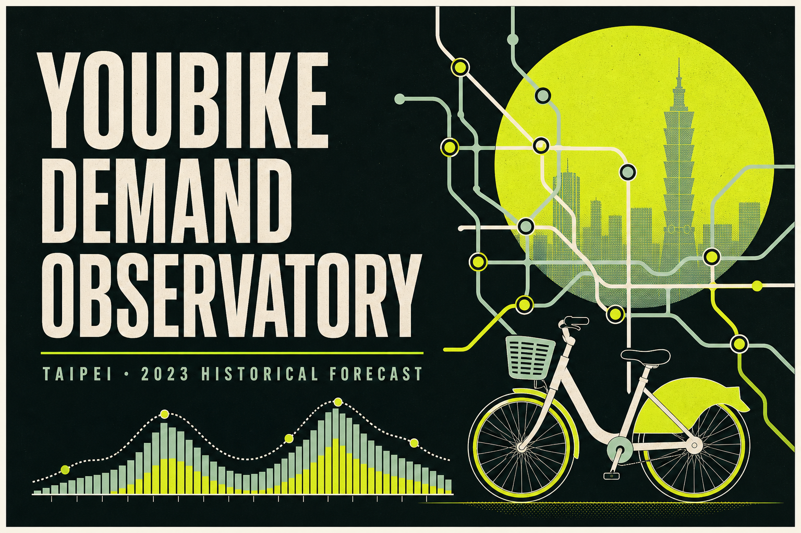

# Historical Dashboard & Offline Research／歷史回測與離線研究展示

This React 19 + Vinext interface explores 10 representative timepoints from the December 2023 Track A holdout. It reads the checked-in static prediction bundle and shows predictions, post-inference actual values, errors, model comparisons, rolling-origin results, and feature importance for the training-defined top-100 stations.

這是 Stage 9 的互動式歷史回測展示，不是即時站點庫存、缺車預警或補車建議。網站讀取由既有模型產生的靜態資料包，讓使用者切換 2023 年 12 月代表性時段，查看 100 個站點的預測、實際值與誤差。



The original hosted deployment remains access-restricted; the September 27 read-only Sites lookup confirms an active existing site with custom access. The new research panel is **local-only, not deployed**. Use the local instructions below; no public access is claimed.

## 新增 Phase 3／4 研究面板

點選「Track B 模型與調度模擬」或進入本機 URL 的 `#track-b`。可查看原 Stage 19 結論、共同 64 站／89,600 序列的 60m LSTM 比較，以及 12 個預定情境的輸入、資源／成本設定、不調度／greedy／MILP 比較和站點間搬運。畫面區分歷史觀測、預測、模擬，不是即時車況。

新資料包只由保存的研究結果建立，不重訓、不呼叫雲端、不修改 Track A 的 `dashboard-data.json`：

```bash
python src/build_offline_dashboard.py
```

已產生的 `app/offline-research-data.json` 可直接使用，freeze 後不需重建。完整證據：[Phase 3–4 報告](../docs/PHASE_3_4_OFFLINE_RESEARCH.md)、[freeze 紀錄](../docs/RESEARCH_FREEZE.md)。

## 原 Track A 資料包重建（本輪未執行）

在專案根目錄執行：

```bash
python src/build_dashboard_data.py
```

這會驗證模型檔案、讀取 target 前 168 小時歷史、重新推論 10 個時段，再更新 `dashboard/app/dashboard-data.json`。

## 本機執行

```bash
cd dashboard
pnpm install
pnpm run dev
```

正式檢查：

```bash
pnpm run lint
pnpm test
```

## 解讀限制

- 預測目標是每小時「轉乘相關借車需求」，不是所有 YouBike 旅次。
- 預測範圍只包含訓練期選出的 100 個高需求站點。
- 畫面是歷史 holdout 回測，不是即時可借車數、缺車預警或補車建議。
- 天氣是臺北單一參考點的歷史再分析資料；未來部署必須改用預測當下可取得的天氣預報。
- 新 Track B 評估沿用已被檢視的固定資料，不能稱新的獨立驗證。LSTM 未超越 HGB；主要設定下 MILP 與 greedy 同分。
- 調度是半容量目標、立即搬運、座標距離代理與合成成本的靜態模擬，不是道路路線、真實車隊或營運效益。
